# Highcharts

## 概述

Highcharts 是一个用纯JavaScript编写的一个图表库， 能够很简单便捷的在web网站或是web应用程序添加有交互性的图表，并且免费提供给个人学习、个人网站和非商业用途使用。HighCharts支持的图表类型有曲线图、区域图、柱状图、饼状图、散状点图和综合图表。


官网地址：https://www.hcharts.cn/


## 特点

* 非商用免费：对于个人网站，学校网站和非盈利机构使用 Highcharts 系列软件，直接使用而不需要经过我们的授权；
* HTML 5：Highcharts 完全基于 HTML5 技术，不需要安装任何插件，也不需要配置 PHP、Java 等运行环境，只需要两个 JS 文件即可使用；
* 开源：源代码基于 Github 托管，任何人都可以下载和修改源码；
* 图表丰富：Highcharts 提供丰富的图表类型，线图、柱形图、饼图、散点图、仪表图、雷达图、热力图、混合图等多，Highstock 则提供股票走势图（K线、分时）、高级时间轴图，Highmaps 提供各种丰富多样的地图；
* 兼容性：兼容 IE6+，同时完美支持移动端触摸操作、手势缩放，并且能够保证在不同的浏览器上做到展现效果和使用体验一致性；
* 动态交互性：支持动态增加、修改、删除数据列、数据点、坐标轴操作，支持多种交互操作，丰富灵活的API可以精准控制图表的每一个细节！


## 下载

https://code.hcharts.cn/highcharts/highcharts.js

https://code.hcharts.cn/highcharts/modules/exporting.js

https://code.hcharts.cn/highcharts/modules/series-label.js

https://code.hcharts.cn/highcharts/modules/oldie.js

https://code.hcharts.cn/plugins/zh_cn.js


下载完5个js文件后，在页面中引入js文件即可

也可以直接使用：

```html
<script src="https://code.hcharts.cn/highcharts/highcharts.js"></script>
<script src="https://code.hcharts.cn/highcharts/modules/exporting.js"></script>
<script src="https://code.hcharts.cn/highcharts/modules/series-label.js"></script>
<script src="https://code.hcharts.cn/highcharts/modules/oldie.js"></script>
<script src="https://code.hcharts.cn/plugins/zh_cn.js"></script>
```


## 官方文档和示例

文档：https://www.hcharts.cn/docs

示例：https://www.hcharts.cn/demo/highcharts/


## 线图

### 基础折线图

```html
<!DOCTYPE html>

<!--
Project name(项目名称)：data_visualization_diagram
  File name(文件名): test1
  Authors(作者）: mao
  Author QQ：1296193245
  GitHub：https://github.com/maomao124/
  Date(创建日期)： 2023/6/10
  Time(创建时间)： 21:21
  Description(描述)： 无
-->

<html lang="en">
<head>
    <meta charset="UTF-8">
    <title>基础折线图</title>

    <script src="./js/highcharts.js"></script>
    <script src="./js/exporting.js"></script>
    <script src="./js/series-label.js"></script>
    <script src="./js/zh_cn.js"></script>

</head>

<style>
    #container {
        width: 70vw;
        height: 70vh;
        position: absolute;
        top: 50%;
        left: 50%;
        transform: translate(-50%, -50%);
    }
</style>
<body>
<div id="container"></div>
<script>
    var chart = Highcharts.chart('container', {
        title: {
            text: '2010 ~ 2016 年太阳能行业就业人员发展情况'
        },
        subtitle: {
            text: '数据来源：thesolarfoundation.com'
        },
        yAxis: {
            title: {
                text: '就业人数'
            }
        },
        legend: {
            layout: 'vertical',
            align: 'right',
            verticalAlign: 'middle'
        },
        plotOptions: {
            series: {
                label: {
                    connectorAllowed: false
                },
                pointStart: 2014
            }
        },
        series: [{
            name: '安装，实施人员',
            data: [43934, 52503, 57177, 69658, 97031, 119931, 137133, 154175]
        }, {
            name: '工人',
            data: [24916, 24064, 29742, 29851, 32490, 30282, 38121, 40434]
        }, {
            name: '销售',
            data: [11744, 17722, 16005, 19771, 20185, 24377, 32147, 39387]
        }, {
            name: '项目开发',
            data: [null, null, 7988, 12169, 15112, 22452, 34400, 34227]
        }, {
            name: '其他',
            data: [12908, 5948, 8105, 11248, 8989, 11816, 18274, 18111]
        }],
        responsive: {
            rules: [{
                condition: {
                    maxWidth: 500
                },
                chartOptions: {
                    legend: {
                        layout: 'horizontal',
                        align: 'center',
                        verticalAlign: 'bottom'
                    }
                }
            }]
        }
    });
</script>

</body>
</html>

```


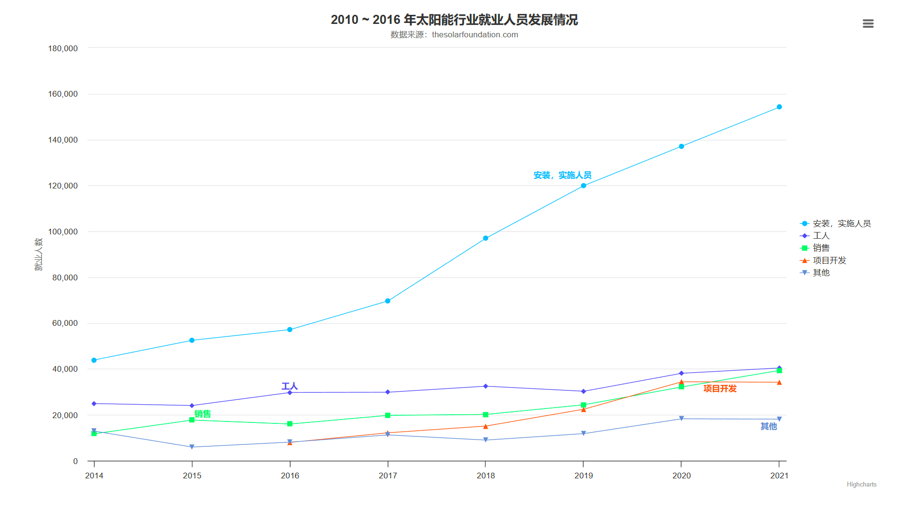


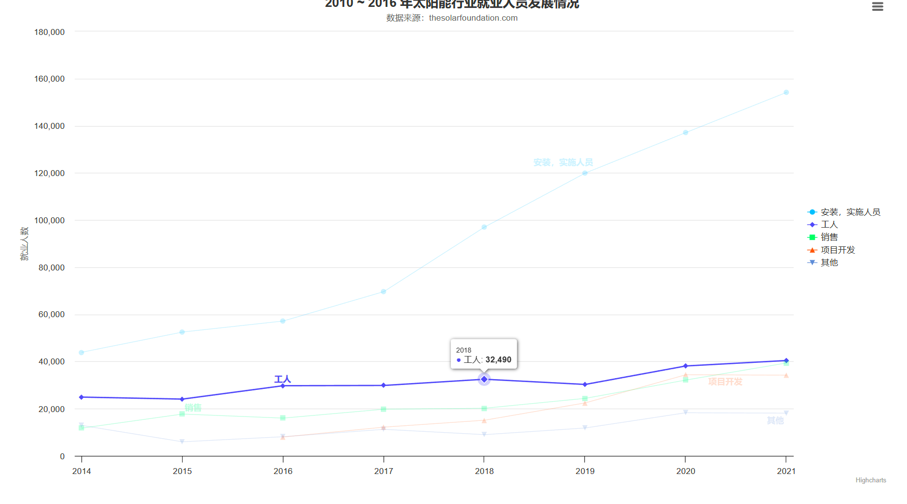


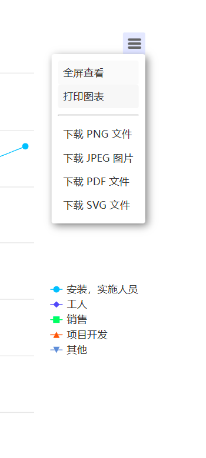


属性解释：

```sh
（1）chart ：图表基本属性
    a)	plotBackgroundColor  区域背景颜色
    b)	plotBorderWidth  区域边框宽度
    c)	plotShadow  区域阴影
    d)	type  图表类型
（2）title ：图表标题
    a)	text 标题文本
（3）tooltip ：工具提示
    a)	pointFormat  工具提示显示格式
（4）plotOptions：区域选项
    a)	allowPointSelect  点击区域后选择
    b)	cursor  光标类型
    c)	dataLabels  数据标签
    d)	showInLegend  是否显示图例
（5）series： 数据组
    a)	name  名称
    b)	colorByPoint  点的颜色
    c)	data  数据
```


### 显示点值的折线图

```html
<!DOCTYPE html>

<!--
Project name(项目名称)：data_visualization_diagram
  File name(文件名): test2
  Authors(作者）: mao
  Author QQ：1296193245
  GitHub：https://github.com/maomao124/
  Date(创建日期)： 2023/6/10
  Time(创建时间)： 21:45
  Description(描述)： 无
-->


<html lang="en">
<head>
    <meta charset="UTF-8">
    <title>显示点值的折线图</title>

    <script src="./js/highcharts.js"></script>
    <script src="./js/exporting.js"></script>
    <script src="./js/series-label.js"></script>
    <script src="./js/zh_cn.js"></script>

</head>

<style>
    #container {
        width: 70vw;
        height: 70vh;
        position: absolute;
        top: 50%;
        left: 50%;
        transform: translate(-50%, -50%);
    }
</style>
<body>
<div id="container"></div>
<script>
    var chart = Highcharts.chart('container', {
        chart: {
            type: 'line'
        },
        title: {
            text: '月平均气温'
        },
        subtitle: {
            text: '数据来源: WorldClimate.com'
        },
        xAxis: {
            categories: ['一月', '二月', '三月', '四月', '五月', '六月', '七月', '八月', '九月', '十月', '十一月', '十二月']
        },
        yAxis: {
            title: {
                text: '气温 (°C)'
            }
        },
        plotOptions: {
            line: {
                dataLabels: {
                    // 开启数据标签
                    enabled: true
                },
                // 关闭鼠标跟踪，对应的提示框、点击事件会失效
                enableMouseTracking: false
            }
        },
        series: [{
            name: '东京',
            data: [7.0, 6.9, 9.5, 14.5, 18.4, 21.5, 25.2, 26.5, 23.3, 18.3, 13.9, 9.6]
        }, {
            name: '伦敦',
            data: [3.9, 4.2, 5.7, 8.5, 11.9, 15.2, 17.0, 16.6, 14.2, 10.3, 6.6, 4.8]
        }]
    });
</script>
```


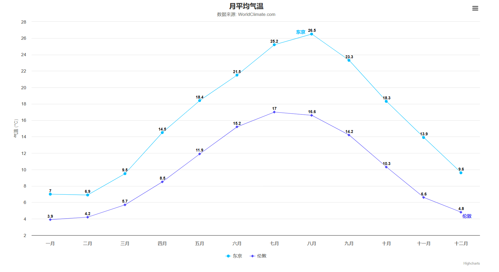


### 可缩放的时间轴

```html
<!DOCTYPE html>

<!--
Project name(项目名称)：data_visualization_diagram
  File name(文件名): test3
  Authors(作者）: mao
  Author QQ：1296193245
  GitHub：https://github.com/maomao124/
  Date(创建日期)： 2023/6/10
  Time(创建时间)： 21:53
  Description(描述)： 无
-->

<html lang="en">
<head>
    <meta charset="UTF-8">
    <title>可缩放的时间轴</title>
    <script src="./js/highcharts.js"></script>
    <script src="./js/exporting.js"></script>
    <script src="./js/series-label.js"></script>
    <script src="./js/zh_cn.js"></script>
    <script src="https://img.hcharts.cn/jquery/jquery-1.8.3.min.js"></script>
</head>

<style>
    #container {
        width: 70vw;
        height: 70vh;
        position: absolute;
        top: 50%;
        left: 50%;
        transform: translate(-50%, -50%);
    }
</style>
<body>
<div id="container"></div>
<script>
    var chart = null;
    $.getJSON('https://data.jianshukeji.com/jsonp?filename=json/usdeur.json&callback=?', function (data)
    {
        chart = Highcharts.chart('container', {
            chart: {
                zoomType: 'x'
            },
            title: {
                text: '美元兑欧元汇率走势图'
            },
            subtitle: {
                text: document.ontouchstart === undefined ?
                    '鼠标拖动可以进行缩放' : '手势操作进行缩放'
            },
            xAxis: {
                type: 'datetime',
                dateTimeLabelFormats: {
                    millisecond: '%H:%M:%S.%L',
                    second: '%H:%M:%S',
                    minute: '%H:%M',
                    hour: '%H:%M',
                    day: '%m-%d',
                    week: '%m-%d',
                    month: '%Y-%m',
                    year: '%Y'
                }
            },
            tooltip: {
                dateTimeLabelFormats: {
                    millisecond: '%H:%M:%S.%L',
                    second: '%H:%M:%S',
                    minute: '%H:%M',
                    hour: '%H:%M',
                    day: '%Y-%m-%d',
                    week: '%m-%d',
                    month: '%Y-%m',
                    year: '%Y'
                }
            },
            yAxis: {
                title: {
                    text: '汇率'
                }
            },
            legend: {
                enabled: false
            },
            plotOptions: {
                area: {
                    fillColor: {
                        linearGradient: {
                            x1: 0,
                            y1: 0,
                            x2: 0,
                            y2: 1
                        },
                        stops: [
                            [0, new Highcharts.getOptions().colors[0]],
                            [1, new Highcharts.Color(Highcharts.getOptions().colors[0]).setOpacity(0).get('rgba')]
                        ]
                    },
                    marker: {
                        radius: 2
                    },
                    lineWidth: 1,
                    states: {
                        hover: {
                            lineWidth: 1
                        }
                    },
                    threshold: null
                }
            },
            series: [{
                type: 'area',
                name: '美元兑欧元',
                data: data
            }]
        });
    });
</script>

</body>
</html>
```


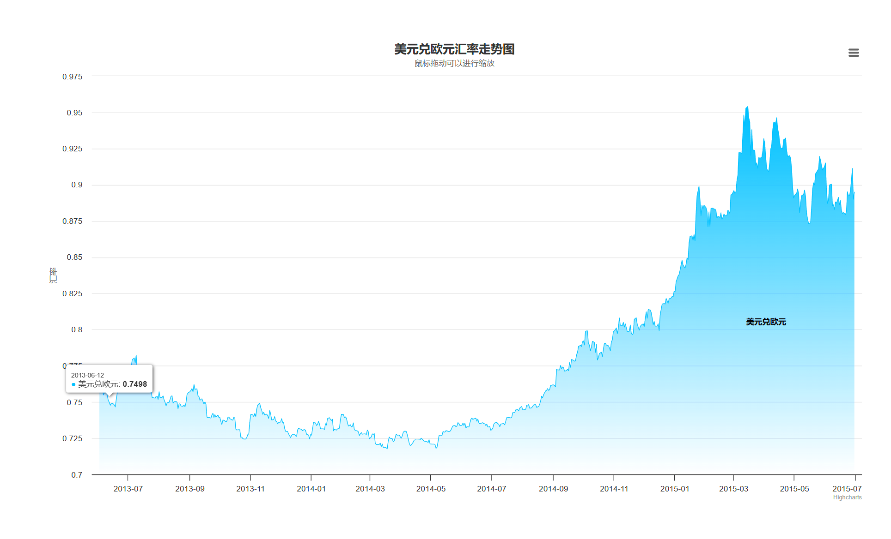


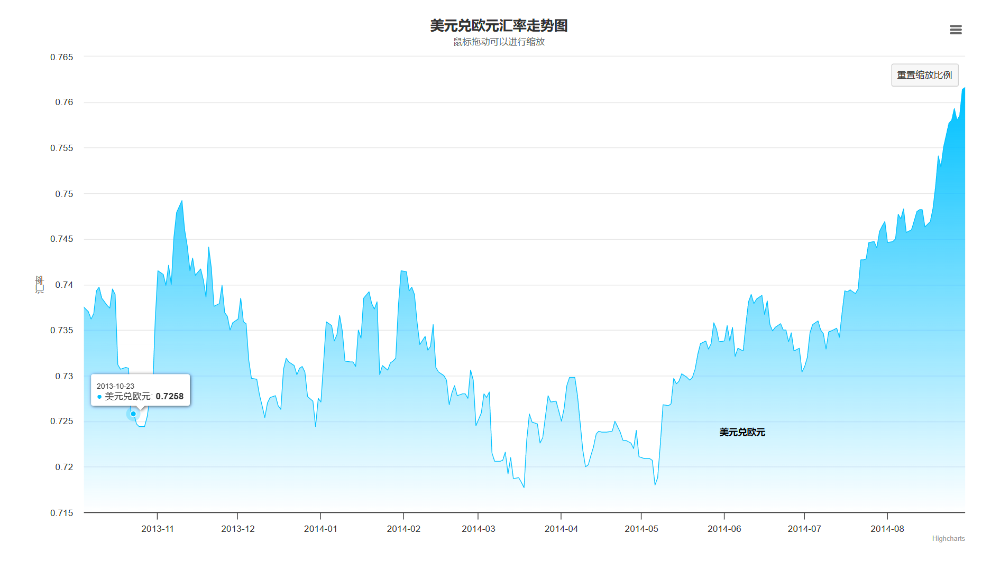


### 大数据量直线图

```html
<!DOCTYPE html>

<!--
Project name(项目名称)：data_visualization_diagram
  File name(文件名): test4
  Authors(作者）: mao
  Author QQ：1296193245
  GitHub：https://github.com/maomao124/
  Date(创建日期)： 2023/6/10
  Time(创建时间)： 22:03
  Description(描述)： 无
-->


<html lang="en">
<head>
    <meta charset="UTF-8">
    <title>可缩放的时间轴</title>
    <script src="./js/highcharts.js"></script>
    <script src="./js/exporting.js"></script>
    <script src="./js/series-label.js"></script>
    <script src="./js/zh_cn.js"></script>
</head>

<style>
    #container {
        width: 70vw;
        height: 70vh;
        position: absolute;
        top: 50%;
        left: 50%;
        transform: translate(-50%, -50%);
    }
</style>
<body>
<div id="container"></div>
<script>
    function getData(n)
    {
        var arr = [],
            i,
            a,
            b,
            c,
            spike;
        for (i = 0; i < n; i = i + 1)
        {
            if (i % 100 === 0)
            {
                a = 2 * Math.random();
            }
            if (i % 1000 === 0)
            {
                b = 2 * Math.random();
            }
            if (i % 10000 === 0)
            {
                c = 2 * Math.random();
            }
            if (i % 50000 === 0)
            {
                spike = 10;
            }
            else
            {
                spike = 0;
            }
            arr.push([
                i,
                2 * Math.sin(i / 100) + a + b + c + spike + Math.random()
            ]);
        }
        return arr;
    }

    var n = 500000,
        data = getData(n);
    console.time('line');
    Highcharts.chart('container', {
        chart: {
            zoomType: 'x'
        },
        boost: {
            useGPUTranslations: true
        },
        title: {
            text: 'Highcharts drawing ' + n + ' points'
        },
        subtitle: {
            text: 'Using the Boost module'
        },
        tooltip: {
            valueDecimals: 2
        },
        series: [{
            data: data,
            lineWidth: 0.5
        }]
    });
    console.timeEnd('line');
</script>

</body>
</html>
```


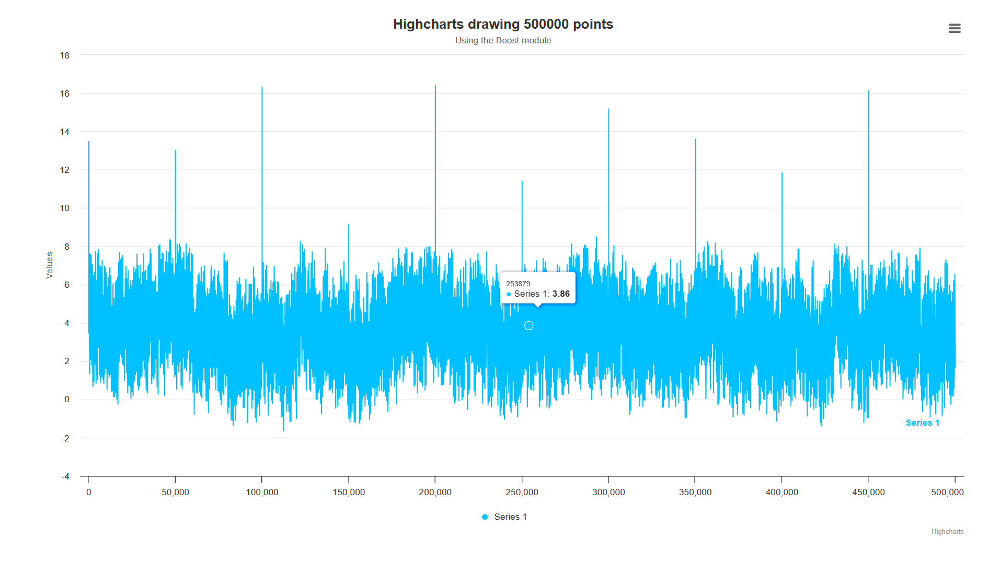


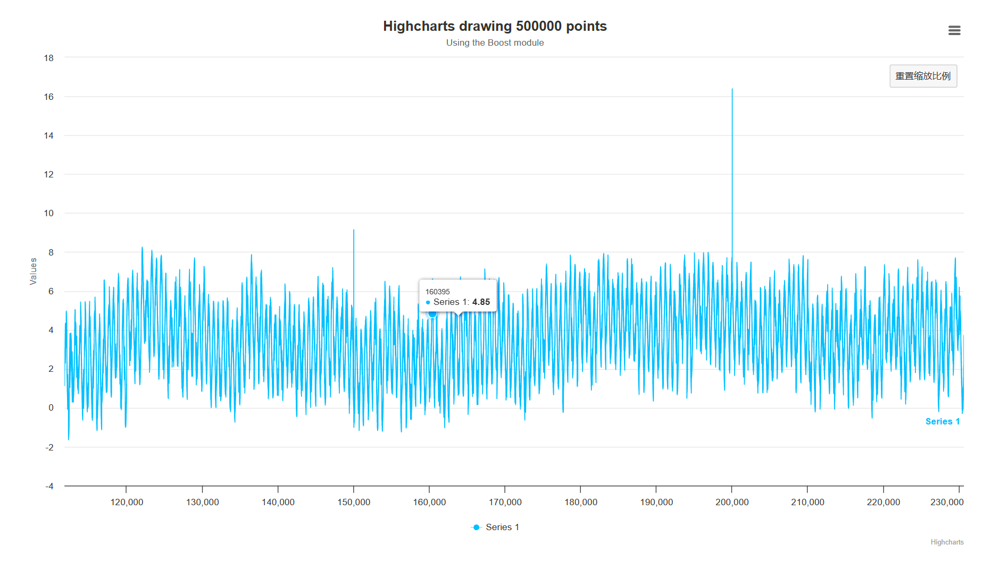


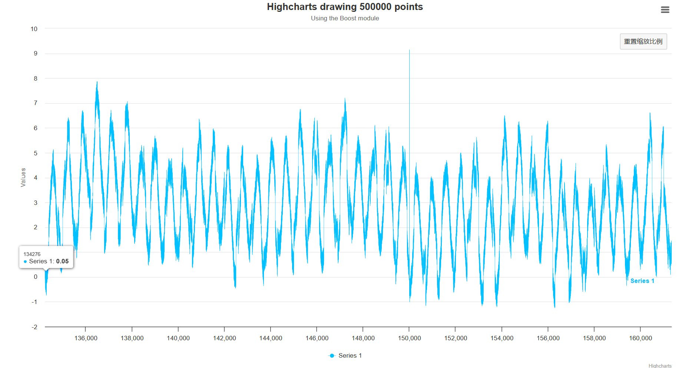


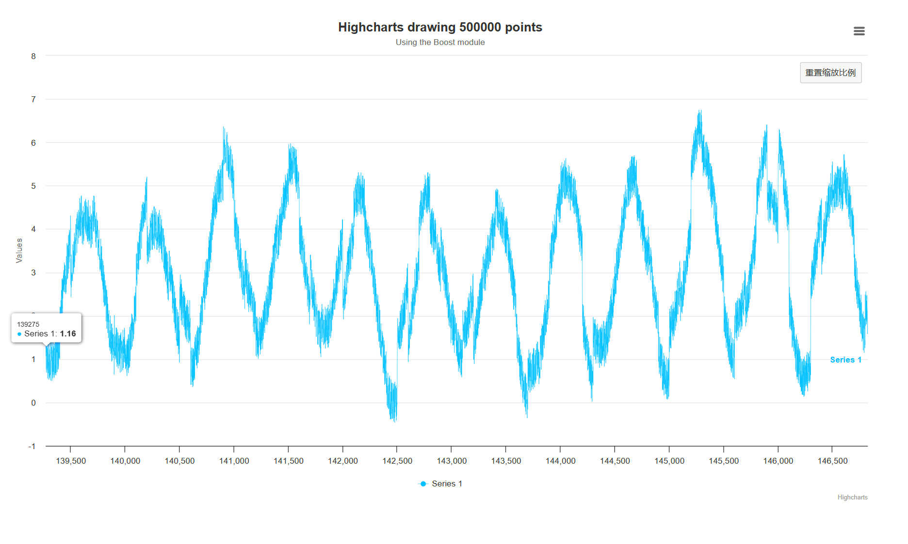


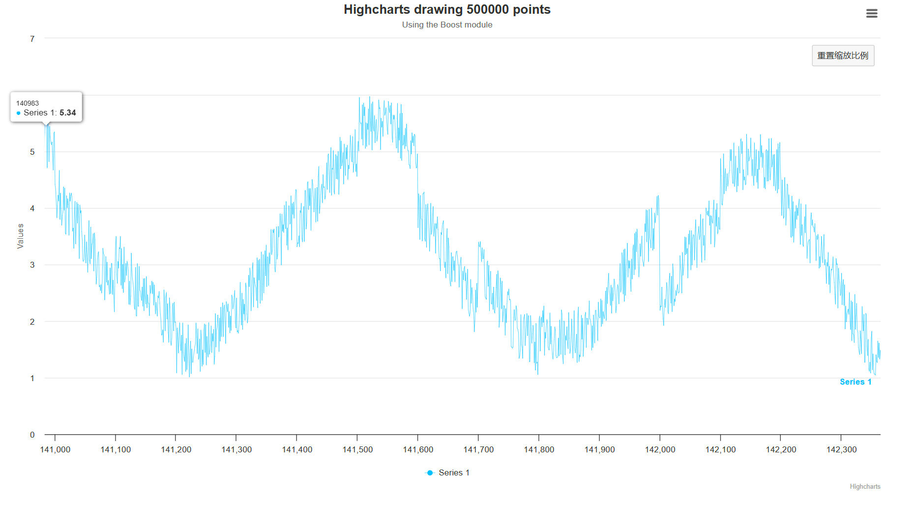

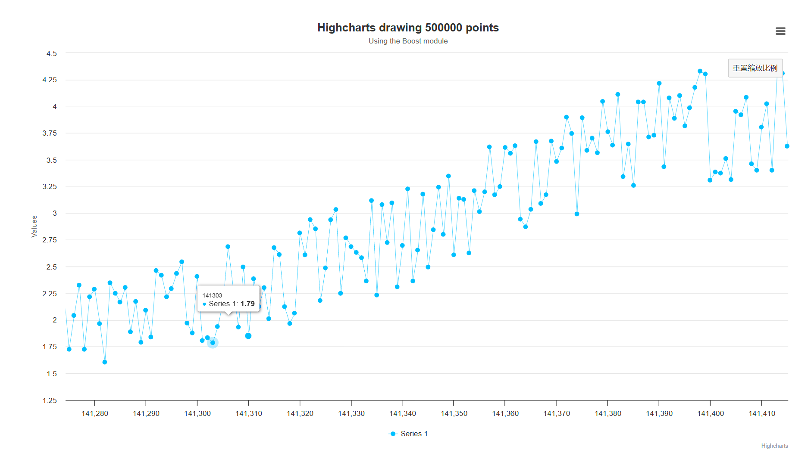


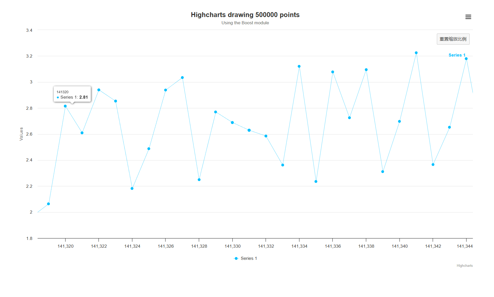


